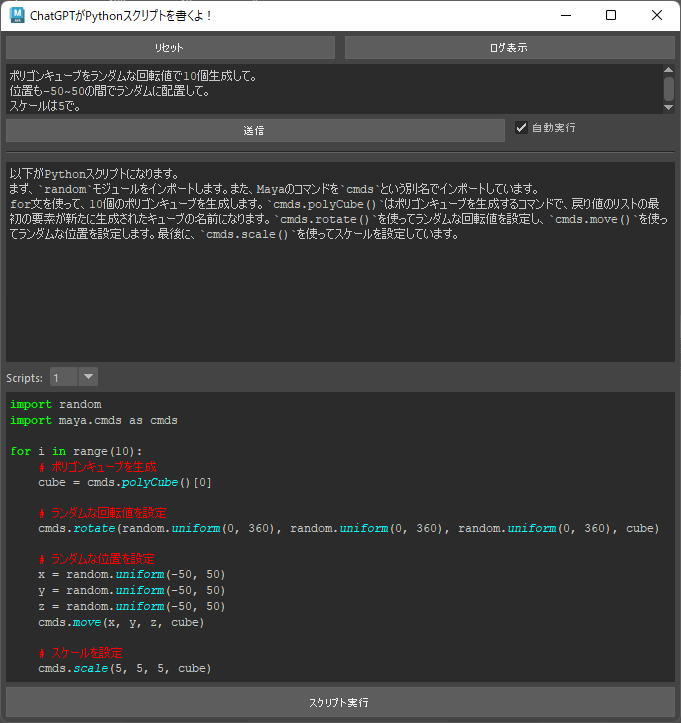
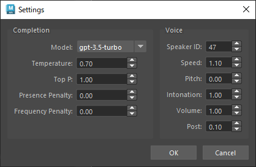

# ChatMaya
A GUI that calls ChatGPT API ([gpt-3.5-turbo / gpt-4](https://platform.openai.com/docs/guides/chat)) from Maya to generate and execute Python/MEL scripts。
If [VOICEVOX ENGINE](https://github.com/VOICEVOX/voicevox_engine) is running, the reading is done at the same time.



> Test Environment :
> * Windows 10/11
> * Maya 2023 (Python3.9.7)
> * Maya 2024 (Python3.10.8)

## Install
1. Obtain an API Key from [Account API Keys - OpenAI API](https://platform.openai.com/account/api-keys) and set it to the environment variable `OPENAI_API_KEY`.

2. Zip download the Code and unzip it to any location.

3. Run `install/install_maya20XX_win.bat` without Maya running.

## Manual Installation
1. Obtain an API Key from [Account API Keys - OpenAI API](https://platform.openai.com/account/api-keys) and set it to the environment variable `OPENAI_API_KEY`.

2. Zip download the Code and unzip it to any location.

3. Install the necessary packages
    * For inclusion in the main body of Maya :
    `mayapy.exe -m pip install -U -r requirements.txt`
    * To install in a Maya version-specific folder under Users :
    `mayapy.exe -m pip install -U -r requirements.txt --target C:/Users/<username>/Documents/maya/<Maya version>/scripts/site-packages`

> The required packages are listed in [install/requirements.txt](install/requirements.txt), and unless the specifications are significantly different, there is no need to strictly match the versions.。
> Consultation : [Using mayapy and pip to manage Python packages](https://help.autodesk.com/view/MAYAUL/2023/JPN/?guid=GUID-72A245EC-CDB4-46AB-BEE0-4BBBF9791627)

4. `chatmaya`Install one of the following:
    * Copy the `chatmaya` folder to `C:/Users/<username>/Documents/maya/<version>/scripts`.
    * Add the parent folder of `chatmaya` to the environment variable `PYTHONPATH`.
    * Append `PYTHONPATH=<chatmaya parent folder>` to `C:/Users/<username>/Documents/maya/<Maya version>/Maya.env`

## Execution
```python
import chatmaya
chatmaya.run()
```

## Usage
* Type the prompt in the text field at the bottom left and press the Send button to send the request to the API and receive a response.
* The response is broken down into Python/MEL code and other parts and displayed in the respective fields.
* If more than one block of code is written in the reply, you will be able to select from the pull-down menu at the bottom of the right side.
* The conversation history will remain until you press New Chat or close the window.（※When the approximate number of tokens exceeds a certain number, the oldest history is removed.）
* Logs, configuration files, and script files you have written are output to `C:\Users\<username>\Documents\maya\ ChatMaya` as needed.
* If [VOICEVOX ENGINE](https://github.com/VOICEVOX/voicevox_engine) is running separately, it will automatically read out the non code block.GPU mode is recommended for use.
* Various settings can be changed from Settings > Open Settings Dialog.
    

## Uninstall
If installed by bat, it will be uninstalled by deleting the following folder.
* Tool itself: `C:\Users\<username>\Documents\maya\<Maya version>\scripts\chatmaya`
* Configuration/Log: `C:\Users\<username>\Documents\maya\ChatMaya`

Additional packages can be done individually with `pip uninstall` or by removing the entire folder below.
* `C:\Users\<username>\Documents\maya\<Maya version>\site-packages`.

## Link
### Explanation, Sample
※ Description as of [beta](https://github.com/akasaki1211/ChatGPT_Maya/tree/beta)
* [Get Maya to work (with Python scripts) using ChatGPT API - Qiita](https://qiita.com/akasaki1211/items/34d0f89e0ae2c6efaf48)
* [Sample (Twitter)](https://twitter.com/akasaki1211/status/1632704327340150787)

### Code Reference
* [Try to create an AI character using ChatGPT API! - Qiita](https://qiita.com/sakasegawa/items/db2cff79bd14faf2c8e0)
* [[Python] How to receive sequential replies with ChatGPT API like the website version - Qiita](https://qiita.com/Cartelet/items/cfc07fc499b6ebbc7dde)
