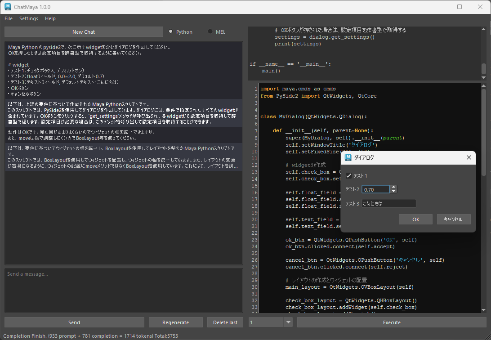

# ChatMaya
A GUI that calls ChatGPT API ([gpt-3.5-turbo / gpt-4](https://platform.openai.com/docs/guides/chat)) from Maya to generate and execute Python/MEL scripts。
If [VOICEVOX ENGINE](https://github.com/VOICEVOX/voicevox_engine) is running, the reading is done at the same time.



> Test Environment :
> * Windows 10/11
> * Maya 2023 (Python3.9.7)
> * Maya 2024 (Python3.10.8)

## Install
1. Obtain an API Key from [Account API Keys - OpenAI API](https://platform.openai.com/account/api-keys) and set it to the environment variable `OPENAI_API_KEY`.

2. Zip download the Code and unzip it to any location.

3. Drag and drap `install.py` file to the Maya viewport.

## Execution
```python
import chatmaya
chatmaya.run()
```

## Usage
* Type the prompt in the text field at the bottom left and press the Send button to send the request to the API and receive a response.
* The response is broken down into Python/MEL code and other parts and displayed in the respective fields.
* If more than one block of code is written in the reply, you will be able to select from the pull-down menu at the bottom of the right side.
* The conversation history will remain until you press New Chat or close the window.（※When the approximate number of tokens exceeds a certain number, the oldest history is removed.）
* Logs, configuration files, and script files you have written are output to `C:\Users\<username>\Documents\maya\ ChatMaya` as needed.
* If [VOICEVOX ENGINE](https://github.com/VOICEVOX/voicevox_engine) is running separately, it will automatically read out the non code block.GPU mode is recommended for use.
* Various settings can be changed from Settings > Open Settings Dialog.
    

## Uninstall
Remove the `ChatGPT_Maya.mod` file in the `C:\Users\<User Name>\Documents\maya\modules` directory.

## Link
### Explanation, Sample
※ Description as of [beta](https://github.com/akasaki1211/ChatGPT_Maya/tree/beta)
* [Get Maya to work (with Python scripts) using ChatGPT API - Qiita](https://qiita.com/akasaki1211/items/34d0f89e0ae2c6efaf48)
* [Sample (Twitter)](https://twitter.com/akasaki1211/status/1632704327340150787)

### Code Reference
* [Try to create an AI character using ChatGPT API! - Qiita](https://qiita.com/sakasegawa/items/db2cff79bd14faf2c8e0)
* [[Python] How to receive sequential replies with ChatGPT API like the website version - Qiita](https://qiita.com/Cartelet/items/cfc07fc499b6ebbc7dde)


## SSL Connection Error
If you try to use this script in a PC at your company, it can cause connection error. Because the Security policies of your company.
1. Go to the [Account API Keys - OpenAI API](https://platform.openai.com/account/api-keys) page in the Chrome browser.
2. 
Download certificate file
3. 
Copy text in the certificate file you downloaded in setp 2.
4. Paste the text to end of the `ChatGPT_Maya\extern\<Python Version>\site-packages\certifi\cacert.pem` file.
5. Restart Maya and run the script.